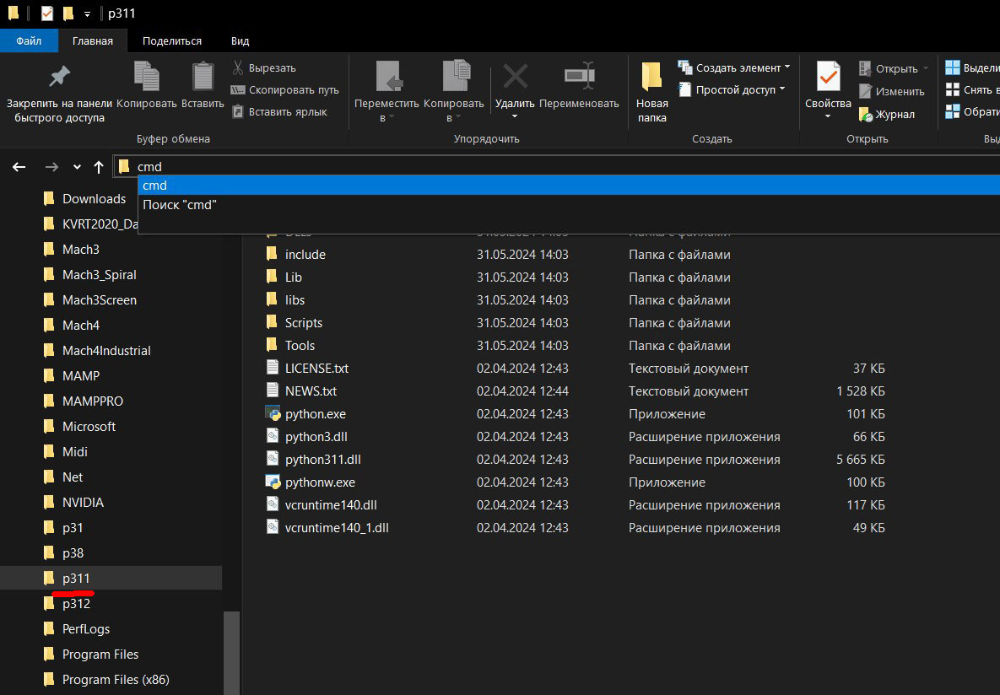

# Правильная установка интерфейса "ComfyUI"
---
## Установка Python 3.11

Со страницы  <a href="https://www.python.org/downloads/windows">https://www.python.org/downloads/windows</a> скачиваем дистрибутив питона версии 3.11

  

---
Запускаем дистрибутив, **ОБЯЗАТЕЛЬНО** ставим администраторские привилегии и убираем галочку на пункте "Добавить в PATH"!!!

  

Мы не будет добавлять путь к питону в PATH по той причине, что, как правило, одним экземпляром питона, и одной версией питона, нам ограничиться в будущем не получится!!!

Со временем возникнет необходимость установить еще одну версию питона, запустить еще один экземпляр питона, и, если у на с путь к питону помещен в PATH, то этот экземпляр питона будет найден первым и все команды, которые мы будем отдавать питону без явного указания  экземпляра питона, будут перехватываться и исполняться именно им, независимо от того, хотим мы этого или нет.

Расположение питона в PATH можно добавлять лишь в том случае, когда вы гарантированно знаете, что у вас будет единственный экземпляр питона, и одно-единственное приложение, работающее на питоне, что бывает крайне редко. Со временем вам потребуется еще что-то добавить, и наличие указателя на питона в PATH приведет к непонятным и трудно-обнаруживаемым ошибкам в работе питона!!!

Поэтому, та технология работы с питоном, которую я вам тут предложу, основана на моем личном опыте работы с несколькими вресиями и экземплярами питона, и более отвечает внутренней идеологии установки и  настройки  питона, чем просто "В Windows так проще". 

---

Устанавливаем все "галочки" так, как на этом фото.

  

---

Устанавливаем все "галочки" так, как на этом фото.

  

Несколько слов об именах папок с питоном - почему именно так: 

1. Придется много набивать адреса "ручками". поэтому чем короче путь, тем лучше!
2. Мы ставим **3.11** версию питона, поэтому имя папки полностью отражает номер версии.
3. Всего существуют такие версии питона: "**3.8**", "**3.9**", "**3.10**", "**3.11**", "**3.12**", "**3.13**" *(в будущем еще добавятся)* и вам надо свободно ориентироваться в номерах версий, и все время помнить номер "текущей рабочей версии питона", которая *(на "сейчас" для ComfyUI)* является "**3.11**". Для другого интерфейса она может иметь другой номер, а через какое-то время выйдет ворсия ComfyUI и для более высоких версий питона *(3.13 и выше)*.  
4. Следовательно, мы резервируем за версиями питона имена следующих папок: "**c:\p38** = версия **3.8**", "**c:\p31** = версия **3.10**", "**c:\p311** = версия **3.11**", "**c:\p312** = версия **3.12**", "**c:\p313**= версия **3.13**" и так далее.    
5. Ведя такую нумерацию в обозначении версий, вы, в процессе набора команды, УЖЕ будете "считывать" то, какой именно версии питона вы отдаете команду, что поможет избежать огромного (!!!) количества ошибок в будущем!
6. Короткий путь с номером версии намного информативнее, чем те пути, кторые предлагает Windows "по умолчанию", когда не то, что "запомнить путь к питону", а даже просто "прочитать путь к питону" будет "МногаБукаФфниАсилил". Это выводы из "опыта".
7. К тому же вы всегда будете помнить, что текущая версия питона у вас расподожен по адресу "**c:\p311\python.exe**" *(расширение EXE можно не набирать)*.

  

---
В проводнике выделяем (делаем активной) папку с питоном, кидаем курсор в адресную строку и там набираем команду "**cmd**" **+ Enter** - так мы запустим окно терминала *(командная строка)*, в котором будем вводить команды питону.

  

---
В открывшемся окне терминала набираем команду "**python --version**"

Питон должен в ответ вывести номер своей версии (см.фото). Если это не так, значит вы что-то упустили в процессе установки, удалите все, и начните с начала, пока не получите в ответ номер версии.

Вообще, привыкните, что проверять работоспособность и ответ питона надо этой командой "**python --version**", и ответом питона должен быть именно ***НОМЕР ВЕРСИИ***, а не просто слово "**Python**"!!! Если вы в ответ получаете только слово "**Python**", и без последующего номера (как на фото), то питон вас **НЕ СЛЫШИТ**!!!     

  

---
Следующая проверка - набираем команду "**python -m pip --version**"

Это команда запроса версии установленного менедежра пакетов питона **PIP**. Он тоже должен в ответе вывести номер сорей версии. Если к моменту проверки версии PIP появилась новая версия самого PIP, то он об этом сообщит, и напишет команду, с помощью которой его можно обновить. Как правило команда для обновления будет выведена зеленым цветом. Просто мышкой прямо на экране выделите (протащите мышкой) эту команду, нажмине "**Ctrl+C**" *(скопировть)*, сразу нажмите "**Ctrl+V**" *(вставить)*, потом "Enter", и он обновится. Если не обновится - ничего страшного, он и так будет продолжать работать без проблем, только будет постоянно сообщать вам, что вышла новая версия. Это не ошибка, это просто "уведомление".  

  

---
## Установка GIT

Следующая программ, которая все время необходима - это **GIT**.

Скачиваем ее дистрибутив с сайта <a href="https://git-scm.com">https://git-scm.com/</a>

  

Выбираем нужную версию (для Windows берите 64-битную):

  

Запускаем дистрибутив, и все оставляем "по умолчанию":

  

Обязательно ставим "Git из командной строки" *(она и так будет выделена по умолчанию)*. Эта "галочка" поместит путь до "git" в "**PATH**", чтобы мы *(и не только мы, но и сам питон)* могли запускать его откуда угодно, из любой папки. 
В отличии от питона, путь к git в "**PATH**" нам очень нужен, чтобы мы могли его запустить не думая о том, где он находится!!! 

  

Из **ЛЮБОГО** места набираем в терминале команрду "**git --version**", и он должен нам ответить номером своей версии. Если что-то не так, как я тут описал, удалите git, и установите его заново по этой инструкции, пока он не ответит вам номером своей версии.

  

После этого, как правило, мы вообще забываем о том, где он у нас установлен, нам достаточно что он дуступен откуда угодно просто по команде "git" в терминале.

---

