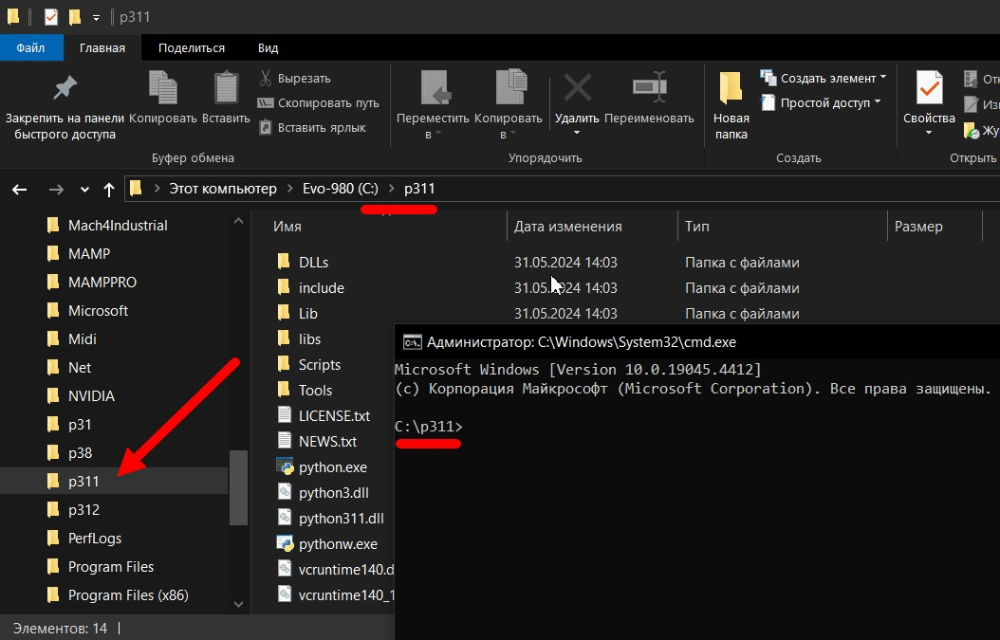

# Правильная установка интерфейса "ComfyUI" (НЕ ЗАКОНЧЕНО!!!)
---
## Установка Python 3.11

Со страницы  <a href="https://www.python.org/downloads/windows">https://www.python.org/downloads/windows</a> скачиваем дистрибутив питона версии 3.11

  

---
Запускаем дистрибутив, **ОБЯЗАТЕЛЬНО** ставим администраторские привилегии и убираем галочку на пункте "Добавить в PATH"!!!

  

Мы не будет добавлять путь к питону в PATH по той причине, что, как правило, одним экземпляром питона, и одной версией питона, нам ограничиться в будущем не получится!!!

Со временем возникнет необходимость установить еще одну версию питона, запустить еще один экземпляр питона, и, если у на с путь к питону помещен в PATH, то этот экземпляр питона будет найден первым и все команды, которые мы будем отдавать питону без явного указания  экземпляра питона, будут перехватываться и исполняться именно им, независимо от того, хотим мы этого или нет.

Расположение питона в PATH можно добавлять лишь в том случае, когда вы гарантированно знаете, что у вас будет единственный экземпляр питона, и одно-единственное приложение, работающее на питоне, что бывает крайне редко. Со временем вам потребуется еще что-то добавить, и наличие указателя на питона в PATH приведет к непонятным и трудно-обнаруживаемым ошибкам в работе питона!!!

Поэтому, та технология работы с питоном, которую я вам тут предложу, основана на моем личном опыте работы с несколькими вресиями и экземплярами питона, и более отвечает внутренней идеологии установки и  настройки  питона, чем просто "В Windows так проще". 

---

Устанавливаем все "галочки" так, как на этом фото.

  

---

Устанавливаем все "галочки" так, как на этом фото.

  

Несколько слов об именах папок с питоном - почему именно так: 

1. Придется много набивать адреса "ручками". поэтому чем короче путь, тем лучше!
2. Мы ставим **3.11** версию питона, поэтому имя папки полностью отражает номер версии.
3. Всего существуют такие версии питона: "**3.8**", "**3.9**", "**3.10**", "**3.11**", "**3.12**", "**3.13**" *(в будущем еще добавятся)* и вам надо свободно ориентироваться в номерах версий, и все время помнить номер "текущей рабочей версии питона", которая *(на "сейчас" для ComfyUI)* является "**3.11**". Для другого интерфейса она может иметь другой номер, а через какое-то время выйдет ворсия ComfyUI и для более высоких версий питона *(3.13 и выше)*.  
4. Следовательно, мы резервируем за версиями питона имена следующих папок: "**c:\p38** = версия **3.8**", "**c:\p31** = версия **3.10**", "**c:\p311** = версия **3.11**", "**c:\p312** = версия **3.12**", "**c:\p313**= версия **3.13**" и так далее.    
5. Ведя такую нумерацию в обозначении версий, вы, в процессе набора команды, УЖЕ будете "считывать" то, какой именно версии питона вы отдаете команду, что поможет избежать огромного (!!!) количества ошибок в будущем!
6. Короткий путь с номером версии намного информативнее, чем те пути, кторые предлагает Windows "по умолчанию", когда не то, что "запомнить путь к питону", а даже просто "прочитать путь к питону" будет "МногаБукаФфниАсилил". Это выводы из "опыта".
7. К тому же вы всегда будете помнить, что текущая версия питона у вас расподожен по адресу "**c:\p311\python.exe**" *(расширение EXE можно не набирать)*.

  

---
В проводнике выделяем (делаем активной) папку с питоном, кидаем курсор в адресную строку и там набираем команду "**cmd**" **+ Enter** - так мы запустим окно терминала *(командная строка)*, в котором будем вводить команды питону.

  

---
В открывшемся окне терминала набираем команду "**python --version**"

Питон должен в ответ вывести номер своей версии (см.фото). Если это не так, значит вы что-то упустили в процессе установки, удалите все, и начните с начала, пока не получите в ответ номер версии.

Вообще, привыкните, что проверять работоспособность и ответ питона надо этой командой "**python --version**", и ответом питона должен быть именно ***НОМЕР ВЕРСИИ***, а не просто слово "**Python**"!!! Если вы в ответ получаете только слово "**Python**", и без последующего номера (как на фото), то питон вас **НЕ СЛЫШИТ**!!!     

  

---
Следующая проверка - набираем команду "**python -m pip --version**"

Это команда запроса версии установленного менедежра пакетов питона **PIP**. Он тоже должен в ответе вывести номер сорей версии. Если к моменту проверки версии PIP появилась новая версия самого PIP, то он об этом сообщит, и напишет команду, с помощью которой его можно обновить. Как правило команда для обновления будет выведена зеленым цветом. Просто мышкой прямо на экране выделите (протащите мышкой) эту команду, нажмине "**Ctrl+C**" *(скопировть)*, сразу нажмите "**Ctrl+V**" *(вставить)*, потом "Enter", и он обновится. Если не обновится - ничего страшного, он и так будет продолжать работать без проблем, только будет постоянно сообщать вам, что вышла новая версия. Это не ошибка, это просто "уведомление".  

  

Мы запомним, что текущая вресия питона, на которой мы работаетм сейчас, находится по адресу:

    c:\p311\python
   
Это очень важно, т.к. вызывать питон  мы всегда будем именно по этому адресу!   

Мы запомним, что вызов текущей вресии PIP, которой мы пользуемся сейчас, вызывается так:

    c:\p311\python -m pip
   
Это очень важно, т.к. вызывать PIP мы всегда будем именно этой командой!   

---
## Установка GIT

Следующая программ, которая все время необходима - это **GIT**.

Скачиваем ее дистрибутив с сайта <a href="https://git-scm.com">https://git-scm.com/</a>

  

Выбираем нужную версию (для Windows берите 64-битную):

  

Запускаем дистрибутив, и все оставляем "по умолчанию":

  

Обязательно ставим "Git из командной строки" *(она и так будет выделена по умолчанию)*. Эта "галочка" поместит путь до "git" в "**PATH**", чтобы мы *(и не только мы, но и сам питон)* могли запускать его откуда угодно, из любой папки. 
В отличии от питона, путь к git в "**PATH**" нам очень нужен, чтобы мы могли его запустить не думая о том, где он находится!!! 

  

Из **ЛЮБОГО** места набираем в терминале команрду "**git --version**", и он должен нам ответить номером своей версии. Если что-то не так, как я тут описал, удалите git, и установите его заново по этой инструкции, пока он не ответит вам номером своей версии.

  

После этого, как правило, мы вообще забываем о том, где он у нас установлен, нам достаточно что он дуступен откуда угодно просто по команде "git" в терминале.

Мы запомним, что для вызова GIT, установленного в нашей системе, используем из любого места команду:

    git
   
Это очень важно, т.к. вызывать git мы всегда будем именно этой командой!   

---
## Установка самого "ComfyUI"

Я советую вам выделить для всех интерфейсов SD одну папку, в которую вы и будете их устанавливать. То, что вы думаете, будто вам хватит только одного - глубоко ошибаетесь. Через 1-2-3-4-5 дней вам захочется попробовать "Fooocus", потом "Forge", и т.п., так что лучше заранее (!) продумать схему их размещения. Я рассматриваю вариант, что мы будем ставить их на диске, где больше всего свободного места. В примере я рассматриваю адрес "d:\SD" как папку, внутри которой будут находиться web-интерфейсы "**ComfyUI**" *(и других, впоследствии)*. Поэтому мы создаем вот такую структуру:

  

... введите в адресной строке команду "**cmd**" и откройте в этой папке окно терминала.

  

Заходим на сайт <a href="https://github.com/comfyanonymous/ComfyUI">https://github.com/comfyanonymous/ComfyUI</a>, нажимаем зеленую кнопку "**Code**" и в открывшемся окне копируем себе git-адрес дистриьбутива "**ComfyUI**":

  

Вводим команду:

    git clone https://github.com/comfyanonymous/ComfyUI.git

... в окно терминала, тем самым даем команду "Создать копию (клонировать) содержимое по git-адресу в текущую папку" (у нас это "d:\SD").

  

Жмем "Enter". Программа "**git**" клонирует все содержимое дистрибутива "**ComfyUI**" в текущую папку (которая у нас "d:\SD"), и у нас в папке "d:\SD" полявляется папка "**ComfyUI**" с точной копией дистрибутива. 

  

Зайдем в эту папку:

  

> Примечание:
> 
> Для того, чтобы скачать (клонировать) точную копию любого приложения с сайта "GitHub", надо открыть окно терминала В ТОЙ ПАПКЕ, В КОТОРУЮ НАДО СКОПИРОВАТЬ ДИСТРИБУТИВ!
> 
> Поле чего ввести команду:

    git clone http://git-адрес-дистрибутива.git

> ... git-адрес СКОПИРОВАТЬ ЗАРАНЕЕ, и выполнить команду.

Зеленой стрелкой отмечена СКРЫТАЯ папка *(у меня включено отображение скрытых файлов)* с именем "**.github**", в которой содержится полная информация о том, откуда именно скачан дистрибутив, его версия и все, что нужно знать системе "git", установленной на компьютере локально.

Красной стрелкой указан файл "**requirements.txt**", который мы рассмотрим немного позднее.

Со временем версии программ меняются, исправляются ошибки, что-то дописывается, что-то удаляется, идет развитие, в некоторых проектах почти ежедневно происходят обновления, поэтому скачанный таким образом дистрибутив (да любой код) может обновляться *(хоть каждый час)* следующим образом:

> Откройте окно терминала в той папке, где видна скрытая папка "**.github**" так, чтобы папка была "текущей" и выполните команду в терминале:

    git pull

  

Сообщение:

    Already up to date.
    
... означает, что у вас установлена самая последняя версия, и в обновленнии она не нуждается.

Если git сравнив вашу версию, и версию на сервере, найдет, что на сервере версия новее чем ваша, он автоматически сам закачает обновления и выведет полный отчет об обновленных файлах.

> Примечание:
> 
> Таким способом обновляются ЛЮБЫЕ ДАННЫЕ, установленные с сервера "GitHub".
> Важно наличие в текущем каталоге скрытой папки "**.github**", из которой git черпает всю информацию, необходимую для обновления версии софта.
> 

Мы закачали с помощью GIT дистрибутив "**ComfyUI**", он у нас обновляемый *(по "git pull")*, теперь перейдем к установкам пакетов питона.

---

## Установка пакетов питона "ComfyUI"

В составе почти любого дистрибутива на языке "**Python**" входит текстовый файл с именем "**requirements.txt**", который соделжит список пакетов питона, которые необходимы ему для работы, и перед использованием приложения, эти пакеты требуется установить в хранилище библиотек питона - папку "**Lib\site_packages**". 

Каждая строка в файле "**requirements.txt**" представляет один пакет (зависимость) и имеет формат имя_пакета==версия, где имя_пакета — это название библиотеки или пакета Python, а версия — это желаемая версия этого пакета (зависимости). Есть такой файл и у "**ComfyUI**".

Открываем установленную папку "**ComfyUI**" и ищем корне файл "**requirements.txt**". Щелкнем по нему, и посмотрим, что в нем.

  

Посмотрим список пакетов, который надо установить:
- torch
- torchsde
- torchvision
- einops
- transformers>=4.25.1
- safetensors>=0.3.0
- aiohttp
- pyyaml
- Pillow
- scipy
- tqdm
- psutil
- kornia>=0.7.1
- spandrel

По опыту работы с "ComfyUI" я, после установки апкетов из файла "**requirements.txt**" применю ПАТЧ, чтобы скорректировать состав пакетов на версии, которые предназначены для работы на картах "**NVIDIA**" и использования видеопамяти этих видеокарт для генерации изображений. Все рассматриваемые здесь настройки ориентированы именно на карты "**NVIDIA**", другими платформами я не занимаюсь!

Для начала убедитесь, что файл "**requirements.txt**" находится на месте:

    D:\SD\ComfyUI\requirements.txt

... чтобы мы могли из его списка установить пакеты в питона. После этого в Эксплорере откройте папку с питоном там, где находится файл "**python.exe**". Введите в адресной строке "**cmd**", чтобы открылось окно терминала. 

  

  

... и введите там команду

    python -m pip install -r D:\SD\ComfyUI\requirements.txt

...после нажатия Enter начнется установка пакетов. Наблюдайте за окном терминала, ждите завершения установки, старайтесь в потоке инфоромации найти слова, свидетельствующие об ошибках как скачивания, так и установки!

  

... ждите завершения установки:

  

Установка закончилась. Все пакеты скачалсь, и установились нормально.

Желтым цветом выведены НЕ ОШИБКИ (!), это всего лишь "предупреждения" о том, что имеющиеся в питоне скрипты не находятся в "PATH", т.к. питон почему-то считает, что он на компьютере в единственном экземпляре и имеет право на существование только он, и всё должно быть подчинено ему-одному-любимому!

Мы ему "хлебальник" немного "подрежем", запросы уменьшим. т.к. сами знаем что, почему и как мы делаем, объяснения будут ниже по тексту.

Кое-кто заметил, что я ставлю пакеты питона прямо в "системный" питон, не создаю "виртуального окружения" (VENV) и т.п. Это не ошибка, это намеренное действие, поскольку "виртуальное окружение" питона я буду создавать начиная только со второго экземпляра web-интерфейса, причем я пойду против значения "по умолчанию" питона при создании VENV, и включу парамметр "наследования пакетов родителя" дочерним VENV питона *(кто понял - молодец, для остальных позже расскажу)*. 

---

