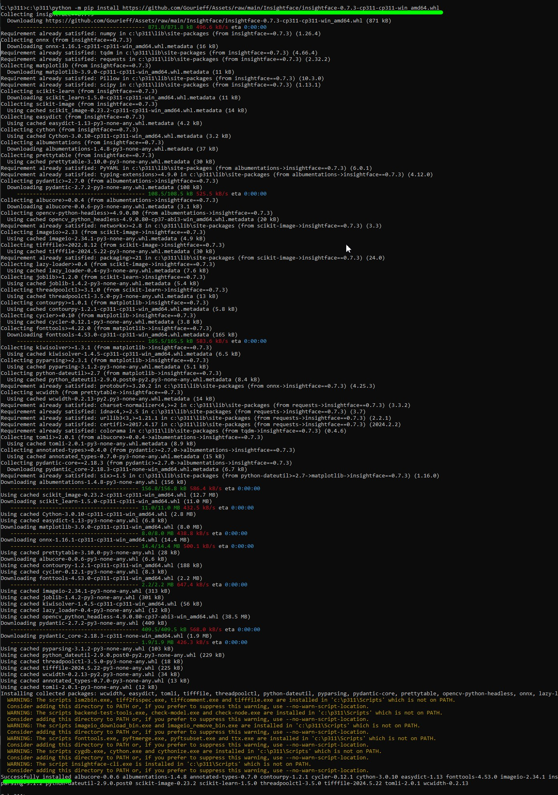
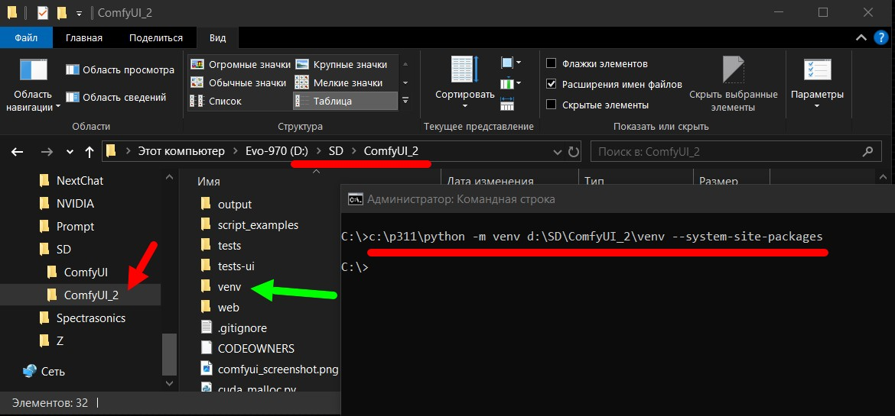
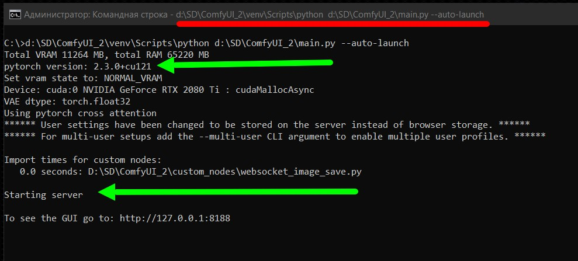

# Правильная установка интерфейса "ComfyUI"

> Основное закончено, потом еще до-полирую.
---
## Установка Python 3.11

Со страницы  <a href="https://www.python.org/downloads/windows">https://www.python.org/downloads/windows</a> скачиваем дистрибутив питона версии 3.11

  

---
Запускаем дистрибутив, **ОБЯЗАТЕЛЬНО** ставим администраторские привилегии и убираем галочку на пункте "Добавить в PATH"!!!

  

Мы не будем добавлять путь к питону в PATH по той причине, что, как правило, одним экземпляром питона, и одной версией питона, нам ограничиться в будущем не получится!!!

Со временем возникнет необходимость установить еще одну версию питона, запустить еще один экземпляр питона, и, если у нас путь к питону помещен в PATH, то этот экземпляр питона будет найден первым и все команды, которые мы будем отдавать питону без явного указания  экземпляра питона, будут перехватываться и исполняться именно им, независимо от того, хотим мы этого или нет.

Расположение питона в PATH можно добавлять лишь в том случае, когда вы гарантированно знаете, что у вас будет единственный экземпляр питона, и одно-единственное приложение, работающее на питоне, что бывает крайне редко. Со временем вам потребуется еще что-то добавить, и наличие указателя на питона в PATH приведет к непонятным и трудно-обнаруживаемым ошибкам в работе питона!!!

Поэтому, та технология работы с питоном, которую я вам тут предложу, основана на моем личном опыте работы с несколькими вресиями и экземплярами питона, и более отвечает внутренней идеологии установки и  настройки  питона, чем просто "В Windows так проще". 

---

Устанавливаем все "галочки" так, как на этом фото.

  

---

Устанавливаем все "галочки" так, как на этом фото.

  

Несколько слов об именах папок с питоном - почему именно так: 

1. Придется много набивать адреса "ручками". поэтому чем короче путь, тем лучше!
2. Мы ставим **3.11** версию питона, поэтому имя папки полностью отражает номер версии.
3. Всего существуют такие версии питона: "**3.8**", "**3.9**", "**3.10**", "**3.11**", "**3.12**", "**3.13**" *(в будущем еще добавятся)* и вам надо свободно ориентироваться в номерах версий, и все время помнить номер "текущей рабочей версии питона", которая *(на "сейчас" для ComfyUI)* является "**3.11**". Для другого интерфейса она может иметь другой номер, а через какое-то время выйдет ворсия ComfyUI и для более высоких версий питона *(3.13 и выше)*.  
4. Следовательно, мы резервируем за версиями питона имена следующих папок: "**c:\p38** = версия **3.8**", "**c:\p31** = версия **3.10**", "**c:\p311** = версия **3.11**", "**c:\p312** = версия **3.12**", "**c:\p313**= версия **3.13**" и так далее.    
5. Ведя такую нумерацию в обозначении версий, вы, в процессе набора команды, УЖЕ будете "считывать" то, какой именно версии питона вы отдаете команду, что поможет избежать огромного (!!!) количества ошибок в будущем!
6. Короткий путь с номером версии намного информативнее, чем те пути, кторые предлагает Windows "по умолчанию", когда не то, что "запомнить путь к питону", а даже просто "прочитать путь к питону" будет "МногаБукаФфниАсилил". Это выводы из "опыта".
7. К тому же вы всегда будете помнить, что текущая версия питона у вас расподожен по адресу "**c:\p311\python.exe**" *(расширение EXE можно не набирать)*.

  

---
В проводнике выделяем (делаем активной) папку с питоном, кидаем курсор в адресную строку и там набираем команду "**cmd**" **+ Enter** - так мы запустим окно терминала *(командная строка)*, в котором будем вводить команды питону.

  

---
В открывшемся окне терминала набираем команду "**python --version**"

Питон должен в ответ вывести номер своей версии (см.фото). Если это не так, значит вы что-то упустили в процессе установки, удалите все, и начните с начала, пока не получите в ответ номер версии.

Вообще, привыкните, что проверять работоспособность и ответ питона надо этой командой "**python --version**", и ответом питона должен быть именно ***НОМЕР ВЕРСИИ***, а не просто слово "**Python**"!!! Если вы в ответ получаете только слово "**Python**", и без последующего номера (как на фото), то питон вас **НЕ СЛЫШИТ**!!!     

  

---
Следующая проверка - набираем команду "**python -m pip --version**"

      python -m pip --version

Это команда запроса версии установленного менедежра пакетов питона **PIP**. Он тоже должен в ответе вывести номер сорей версии. Если к моменту проверки версии PIP появилась новая версия самого PIP, то он об этом сообщит, и напишет команду, с помощью которой его можно обновить. Как правило команда для обновления будет выведена зеленым цветом. Просто мышкой прямо на экране выделите (протащите мышкой) эту команду, нажмине "**Ctrl+C**" *(скопировть)*, сразу нажмите "**Ctrl+V**" *(вставить)*, потом "Enter", и он обновится. Если не обновится - ничего страшного, он и так будет продолжать работать без проблем, только будет постоянно сообщать вам, что вышла новая версия. Это не ошибка, это просто "уведомление".  

  

Мы запомним, что текущая вресия питона, на которой мы работаетм сейчас, находится по адресу:

    c:\p311\python
   
Это очень важно, т.к. вызывать питон  мы всегда будем именно по этому адресу!   

Мы запомним, что вызов текущей вресии PIP, которой мы пользуемся сейчас, вызывается так:

    c:\p311\python -m pip
   
Это очень важно, т.к. вызывать PIP мы всегда будем именно этой командой!   

---
## Установка GIT

Следующая программ, которая все время необходима - это **GIT**.

Скачиваем ее дистрибутив с сайта <a href="https://git-scm.com">https://git-scm.com/</a>

  

Выбираем нужную версию (для Windows берите 64-битную):

  

Запускаем дистрибутив, и все оставляем "по умолчанию":

  

Обязательно ставим "Git из командной строки" *(она и так будет выделена по умолчанию)*. Эта "галочка" поместит путь до "git" в "**PATH**", чтобы мы *(и не только мы, но и сам питон)* могли запускать его откуда угодно, из любой папки. 
В отличии от питона, путь к git в "**PATH**" нам очень нужен, чтобы мы могли его запустить не думая о том, где он находится!!! 

  

Из **ЛЮБОГО** места набираем в терминале команрду "**git --version**", и он должен нам ответить номером своей версии.

      git --version

Если что-то не так, как я тут описал, удалите git, и установите его заново по этой инструкции, пока он не ответит вам номером своей версии.

  

После этого, как правило, мы вообще забываем о том, где он у нас установлен, нам достаточно что он дуступен откуда угодно просто по команде "git" в терминале.

Мы запомним, что для вызова GIT, установленного в нашей системе, используем из любого места команду:

    git
   
Это очень важно, т.к. вызывать git мы всегда будем именно этой командой!   

---
## Установка самого "ComfyUI"

Я советую вам выделить для всех интерфейсов SD одну папку, в которую вы и будете их устанавливать. То, что вы думаете, будто вам хватит только одного - глубоко ошибаетесь. Через 1-2-3-4-5 дней вам захочется попробовать "Fooocus", потом "Forge", и т.п., так что лучше заранее (!) продумать схему их размещения. Я рассматриваю вариант, что мы будем ставить их на диске, где больше всего свободного места. В примере я рассматриваю адрес "d:\SD" как папку, внутри которой будут находиться web-интерфейсы "**ComfyUI**" *(и других, впоследствии)*. Поэтому мы создаем вот такую структуру:

  

... введите в адресной строке команду "**cmd**" и откройте в этой папке окно терминала.

  

Заходим на сайт <a href="https://github.com/comfyanonymous/ComfyUI">https://github.com/comfyanonymous/ComfyUI</a>, нажимаем зеленую кнопку "**Code**" и в открывшемся окне копируем себе git-адрес дистрибутива "**ComfyUI**":

  

Вводим команду:

    git clone https://github.com/comfyanonymous/ComfyUI.git

... в окно терминала, тем самым даем команду "Создать копию (клонировать) содержимое по git-адресу в текущую папку" (у нас это "d:\SD").

  

Жмем "Enter". Программа "**git**" клонирует все содержимое дистрибутива "**ComfyUI**" в текущую папку (которая у нас "d:\SD"), и у нас в папке "d:\SD" полявляется папка "**ComfyUI**" с точной копией дистрибутива. 

  

Зайдем в эту папку:

  

> Примечание:
> 
> Для того, чтобы скачать (клонировать) точную копию любого приложения с сайта "GitHub", надо открыть окно терминала В ТОЙ ПАПКЕ, В КОТОРУЮ НАДО СКОПИРОВАТЬ ДИСТРИБУТИВ!
> 
> Поле чего ввести команду:

    git clone http://git-адрес-дистрибутива.git

> ... git-адрес СКОПИРОВАТЬ ЗАРАНЕЕ, и выполнить команду.

Зеленой стрелкой отмечена СКРЫТАЯ папка *(у меня включено отображение скрытых файлов)* с именем "**.github**", в которой содержится полная информация о том, откуда именно скачан дистрибутив, его версия и все, что нужно знать системе "git", установленной на компьютере локально.

Красной стрелкой указан файл "**requirements.txt**", который мы рассмотрим немного позднее.

Со временем версии программ меняются, исправляются ошибки, что-то дописывается, что-то удаляется, идет развитие, в некоторых проектах почти ежедневно происходят обновления, поэтому скачанный таким образом дистрибутив (да любой код) может обновляться *(хоть каждый час)* следующим образом:

> Откройте окно терминала в той папке, где видна скрытая папка "**.github**" так, чтобы папка была "текущей" и выполните команду в терминале:

    git pull

  

Сообщение:

    Already up to date.
    
... означает, что у вас установлена самая последняя версия, и в обновленнии она не нуждается.

Если git сравнив вашу версию, и версию на сервере, найдет, что на сервере версия новее чем ваша, он автоматически сам закачает обновления и выведет полный отчет об обновленных файлах.

> Примечание:
> 
> Таким способом обновляются ЛЮБЫЕ ДАННЫЕ, установленные с сервера "GitHub".
> Важно наличие в текущем каталоге скрытой папки "**.github**", из которой git черпает всю информацию, необходимую для обновления версии софта.
> 

Мы закачали с помощью GIT дистрибутив "**ComfyUI**", он у нас обновляемый *(по "git pull")*, теперь перейдем к установкам пакетов питона.

---

## Установка пакетов питона "ComfyUI"

В составе почти любого дистрибутива на языке "**Python**" входит текстовый файл с именем "**requirements.txt**", который соделжит список пакетов питона, которые необходимы ему для работы, и перед использованием приложения, эти пакеты требуется установить в хранилище библиотек питона - папку "**Lib\site_packages**". 

Каждая строка в файле "**requirements.txt**" представляет один пакет (зависимость) и имеет формат имя_пакета==версия, где имя_пакета — это название библиотеки или пакета Python, а версия — это желаемая версия этого пакета (зависимости). Есть такой файл и у "**ComfyUI**".

Открываем установленную папку "**ComfyUI**" и ищем корне файл "**requirements.txt**". Щелкнем по нему, и посмотрим, что в нем.

  

Посмотрим список пакетов, который надо установить:
- torch
- torchsde
- torchvision
- einops
- transformers>=4.25.1
- safetensors>=0.3.0
- aiohttp
- pyyaml
- Pillow
- scipy
- tqdm
- psutil
- kornia>=0.7.1
- spandrel

По опыту работы с "ComfyUI" я, после установки апкетов из файла "**requirements.txt**" применю ПАТЧ, чтобы скорректировать состав пакетов на версии, которые предназначены для работы на картах "**NVIDIA**" и использования видеопамяти этих видеокарт для генерации изображений. Все рассматриваемые здесь настройки ориентированы именно на карты "**NVIDIA**", другими платформами я не занимаюсь!

Для начала убедитесь, что файл "**requirements.txt**" находится на месте:

    D:\SD\ComfyUI\requirements.txt

... чтобы мы могли из его списка установить пакеты в питона. После этого в Эксплорере откройте папку с питоном там, где находится файл "**python.exe**". Введите в адресной строке "**cmd**", чтобы открылось окно терминала. 

  

  

... и введите там команду

    python -m pip install -r D:\SD\ComfyUI\requirements.txt

...после нажатия Enter начнется установка пакетов. Наблюдайте за окном терминала, ждите завершения установки, старайтесь в потоке инфоромации найти слова, свидетельствующие об ошибках как скачивания, так и установки!

  

... ждите завершения установки:

  

Установка закончилась. Все пакеты скачалсь, и установились нормально.

Желтым цветом выведены НЕ ОШИБКИ (!), это всего лишь "предупреждения" о том, что имеющиеся в питоне скрипты не находятся в "PATH", т.к. питон почему-то считает, что он на компьютере в единственном экземпляре и имеет право на существование только он, и всё должно быть подчинено ему-одному-любимому!

Мы ему "хлебальник" немного "подрежем", запросы уменьшим. т.к. сами знаем что, почему и как мы делаем, объяснения будут ниже по тексту.

Кое-кто заметил, что я ставлю пакеты питона прямо в "системный" питон, не создаю "виртуального окружения" (VENV) и т.п. Это не ошибка, это намеренное действие, поскольку "виртуальное окружение" питона я буду создавать начиная только со второго экземпляра web-интерфейса, причем я пойду против значения "по умолчанию" питона при создании VENV, и включу парамметр "наследования пакетов родителя" дочерним VENV питона *(кто понял - молодец, для остальных позже расскажу)*. 

---

## ПАТЧ пакетов питона для "ComfyUI"

Для того, чтобы сразу, в самом начале инсталляции пакетов питона исправить возможные ошибки, я вручную составлю команды для установки именно тех версий пакетов питона, которые будут без проблем работать с "**ComfyUI**" на картах "**NVIDIA**".

Копируйте команды, можете построчно, можете все сразу скопировать, а потом вставить в терминал (Ctrl+V):

    c:\p311\python -m pip uninstall torch torchvision torchaudio onnxruntime insightface -y
    c:\p311\python -m pip install torch torchvision --index-url https://download.pytorch.org/whl/cu121
    c:\p311\python -m pip install onnxruntime-gpu
    c:\p311\python -m pip install https://github.com/Gourieff/Assets/raw/main/Insightface/insightface-0.7.3-cp311-cp311-win_amd64.whl
    pause
    
>Примечание: адрес в последней команде меняется в зависимости от версии питона 
>     
>для питона 3.9
> 
> https://github.com/Gourieff/Assets/raw/main/Insightface/insightface-0.7.3-cp39-cp39-win_amd64.whl
> 
>для питона 3.10
> 
> https://github.com/Gourieff/Assets/raw/main/Insightface/insightface-0.7.3-cp310-cp310-win_amd64.whl
> 
>для питона 3.11
> 
> https://github.com/Gourieff/Assets/raw/main/Insightface/insightface-0.7.3-cp311-cp311-win_amd64.whl
> 
>для питона 3.12
> 
> https://github.com/Gourieff/Assets/raw/main/Insightface/insightface-0.7.3-cp312-cp312-win_amd64.whl
    
Описание команд по порядку (и что исправляет):

1. Удаляет CPU-версии TORCH, ONNXRUNTIME, INSIGHTFACE, если что-то не установлено, так и напишет "Пропущено" (Scipping).
2. Устанавливает последние GPU-версии TORCH, TORCHVISION
3. Устанавливает GPU-версию ONNXRUNTIME-GPU
4. Иcправляет неудачную установку Insightface (используется в ReActor, софте определения лиц и т.п.)

  

  

Это основные "из опыта работы" патчи "**ComfyUI**", выявленные за последнее время в его пакетах.

---

## Запуск "ComfyUI" в этой "комплектации"

Команда запуска "ComfyUI" строится так:

    диск:\путь_к_питону\python + диск:\путь_к_комфи\main.py + любые ключи запуска   
      
Адрес питона:

    c:\p311\python

Адрес "**ComfyUI**":
    
    d:\sd\comfyui\main.py
    
Ключ для авто-запуска браузера:    
    
    --auto-launch

Соединяем все вместе *(можете в BAT-файл сохранить)*:

    c:\p311\python d:\sd\comfyui\main.py --auto-launch
        
Пробный запуск - работает.

  
 
  

---
## Установка второго экземпляра "ComfyUI"

Сделаем мы это для того, чтобы понять еще пару принципов построения программ на питоне + немного разберемся в принципе наименовании папок web-интерфейсов SD.

Для начала переименуем папку "**ComfyUI**" в "**ComfyUI_1**"

  

Откроем в эксплорере папку "**d:\SD**", введем в адресной строке команду "**cmd**" и откроем в этой папке окно терминала.

Зеленой стрелкой отмечена переименованная нами папка "**ComfyUI_1**". Поскольку мы сейчас будем устанавливать вторую копию **ComfyUI**, а она по команде "**git clone**" будет ставиться в папку с таким же именем, что и уже установленная первая копия (**ComfyUI**), мы и переименовали папку первой копии для того, чтобы не затереть уже установленную копию новой.

  

Заходим на сайт <a href="https://github.com/comfyanonymous/ComfyUI">https://github.com/comfyanonymous/ComfyUI</a>, нажимаем зеленую кнопку "Code" и в открывшемся окне копируем себе git-адрес дистрибутива "ComfyUI":

  

Вводим команду:

    git clone https://github.com/comfyanonymous/ComfyUI.git

  

... в окно терминала, и у нас устанавливается вторая копия **ComfyUI** *(первая копия **ComfyUI** у нас не перезапишется, поскольку она уже переименована)*.

  

      
После того, как она установится, переименуем ее в "**ComfyUI_2**" (НЕ ЗАПУСКАТЬ!!!)

  

А папке "**ComfyUI_1**" вернем ее прежнее имя - "**ComfyUI**"

  

> Пояснение:
> 
> Код из первой папки у нас уже запускался для тестирования, поэтому в дереве его папок уже создались папки кеширования кода питона с именами ***pycache***, а в папке "**ComfyUI_2**", этих папок еще нет, поскольку код из них еще не запускался.
> 
> Поэтому возьмите себе за правило: корневую папку только что скачанного и еще НИ РАЗУ НЕ ЗАПУСКАВШЕГОСЯ дистрибутива питона можно переименовать КАК УГОДНО!
> 
> Работоспособность приложения питона не зависит от названия папки, в которой он находится!
> 
> Можно переименовать и после запуска, но тогда возможны ошибки, связанные с тем, что хоть раз запущенное приложение уже закешировано с теми путями, какие были на момент последнего его запуска, и до обновления кэша оно может выдавать непредвиденные ошибки! К тому же, если переименовать путь к приложению после того, как на старых путях уже сохранился кэш, у питона уйдет много времени на запуск приложения и создание нового кеша.
>
> Поэтому - имя папки первого экземпляра ComfyUI я вернул к тому имени, которое было на момент запуска и создания его кеша, а второй экземпляр (***ComfyUI_2***) я еще не запускал, кэша там нет, и папку "***ComfyUI_2***" я могу сейчас переименова так, как МНЕ удобно! Если я переименую ее после первого запуска, возможны ошибки кэша!
> 
> УСТРАНЕНИЕ ОШИБОК КЭША: просто удалить ВСЕ папки ***pycache*** внутри дерева каталогов приложения. Питон при следующем запуске потратит время на создание нового кэша, после чего начнет работать с нормальной скоростью.

  

---

## Создание **VENV** для второго экземпляра "**ComfyUI**"

Поскольку у нас уже установлена вторая копия приложения, мы сейчас изолируем его от первого так, чтобы оно от него не зависело, но использовало все библиотеки (пакеты) первого.

>Примечание:
>
>Возможности питона зависят от установленных в него т.н. "библиотек" (пакетов), которые находятся в его папке "***Lib\site_packages***".
> 
>Изоляция экземпляров приложений нужна для того, чтобы избежать конфликта версий пакетов питона, например:
> 
>- одно приложение требует какой-то пакет версии не выше "**3.34**"
>  
>- второе приложение требует такой же пакет, но версии "**5.13**"
> 
>Поскольку пакеты являются просто разными версиями одной и той же библиотеки (пакета), то в системе может быть установлен только один пакет с таким именем, в результате у нас работоспособоно или первое приложение, или второе, а вместе, на одном питоне их запустить не получится.

Для изолирования приложений друг от друга в питоне предназначена технология **VENV** *(виртуальное окружение питона)*.

На практие оно представляет из себя "мини-экземпляр питона, со своими библиотеками", и содержит в себе только ту часть от основного питона, которая нужна для изоляции экземпляров друг от друга, а элементы питона, которые могут быть использованы совместно, берутся из основного экземпляра питона.

У нас питон находится по адресу "**c:\p311\python**", поэтому для того, чтобы создать VENV (виртуальное окружение) для второго экземпляра "**ComfyUI**", мы построим следующую команду:

Запуск питона:

    c:\p311\python
    
... команда "запустить модуль":

    -m
    
... запустить модуль с именем "venv"    

    venv
    
... создать "виртуальное окружение" по указанному пути в папке с именем "venv":

    d:\SD\ComfyUI_2\venv
    
... включить "наследование" пакетов питона:

    --system-site-packages
    
Соединим все, и получим команду:

    c:\p311\python -m venv d:\SD\ComfyUI_2\venv --system-site-packages

В результате выполнения этой команды внутри нашей папки "**ComfyUI_2**" появится папка "**venv**"

  

    
 
Эта папка и будет содержать питона для запуска интерфейса "**ComfyUI_2**".

Зайдем в нее и в ее корне откроем файл его конфигурации с именем "**pyvenv.cfg**". В файле есть параметр

    include-system-site-packages = true
    

  

... установка его в TRUE включает "наследование" всех пакетов состемного питиона этим VENV, установка его в FALSE делает пакеты питона-родителя для этого "venv" недоступными.

Этот параметр можно менять в любое время, не обязательно в момент создания VENV, но после его смены требуется перезапуск питона.

Сравним теперь папки "библиотек" двух экземпляров питона *(системного и venv)*. В первый мы устанавливали ВСЕ пакеты, которые требуются для работы "**ComfyUI**", а в venv мы пока не устанавливали ничего, поэтому он почти пустой *(в нем только минимум пакетов)*:
                                                                                                                                        

  

А теперь стандартно активируем только что созданное VENV и выполним там "pip list" *(вывод списка пакетов)*. При включенном параметре "***include-system-site-packages = true***" ему доступны ВСЕ пакеты того питона, которые установлены в том питоне, от которого устанавливалось это VENV. Указатель на "питона-родителя" имеется в файле конфигурации каждого **VENV**.

  

Эти "наследуемые" пакеты доступны ему в режиме "только чтение", он не может их ни удалить, ни изменить, ни что-то новое в них установить. Любые операции с пакетами командами **PIP** распространяются в venv только НА ЕГО ЛОКАЛЬНУЮ БИБЛИОТЕКУ.
   

Вот попытка из VENV удалить что-то в пакетах системного питона. В удалении произвольного пакета *(yarl в примере)* в пакетах системного питона ОТКАЗАНО:

Заодно посмотрите (обведено розовым) какие пакеты доступны "для чтения" из системного питона по "наследованию". 

Экономия только на одном "***torch-cuda***" дает экономию места около 4,5 гигабайт на каждый экземпляр питон-приложения.

  

---

А теперь запустим второй экземпляр приложения - "**ComfyUI_2**"

Я не буду "шаманить" с активацией VENV *(как обычно делают)*, я знаю, что при запуске питона он все пути начинает отсчитывать "от себя" и при старте ищет сначала файлы конфигурации, и, если находит их, то берет настройки оттуда.

Поэтому запуск "**ComfyUI_2**" будет таким:

Путь к питону в VENV

    d:\SD\ComfyUI_2\venv\Scripts\python
    
Путь к файлу запуска второго экземпляра

    d:\SD\ComfyUI_2\main.py
    
Ключ автозапуска браузера

    --auto-launch
    
Соединяем все вместе

    d:\SD\ComfyUI_2\venv\Scripts\python d:\SD\ComfyUI_2\main.py --auto-launch

Выполняем, все работает (активация VENV не требуется!):

  

Как видите, все работает, хотя мы ни одного пакета питона во второй экземпляр приложения не ставили, и даже не инициализировали его файл "**requirements.txt**".

  

---

>Приимечание:
> 
>Активация VENV не требуется только в случае, если мы запуск любой команды отдаем самому питону (python.exe), а не его утилитам, модулям, PIP и т.п..

Для VENV работоспособны такие команды:

    d:\SD\ComfyUI_2\venv\Scripts\python -m pip install @@@@@@@@
    d:\SD\ComfyUI_2\venv\Scripts\python -m venv d:\123\venv123
    d:\SD\ComfyUI_2\venv\Scripts\python d:\SD\ComfyUI\main.py --auto-launch
    
... и НЕ РАБОТОСПОСОБНЫ такие:

    pip install @@@@@@@@
    python main.py --auto-launch
    
Без активации **VENV** любая команда доступна, только если она начинается с самого питона с указанием полного пути к нему *(или без полного пути, но с запуском питона "из текущего каталога")*:

    d:\SD\ComfyUI_2\venv\Scripts\python @@@@@@@@@@@@@@@@@@@@@@@@

>Примечание:
> 
>Если у вас установлено более одного экземпляра питона (разные версии, портабельный, venv) и меется более одного файла "**python.exe**" в разных установках, то отдача команд питону сотоит в указании полного пути до конкретного экземпляра файла "**pyhton.exe**" + сама команда и ее аргументы.
> 
>При этом без разнецы как этот питон установлен: VENV, портабельный, истемный и т.п., запуска конкретного питона осуществляется запуском конкретного файла "**python.exe**" с указанием полного пути до него!
> 
>Следует помнить, что. при установке более одного питона, пути к любому из них НЕ ДОЛЖНЫ БЫТЬ В "**PATH**"!!! Наличие путей в "**PATH**" может привести к перхвату управлени тем питоном, который внесен в PATH, а не тем, которому вы отдаете команду!!!

Гораздо проще набрать "короткий" путь к файлу "**python.exe**" вот так:

      c:\p311\python -m pip install
      c:\312\python --version
      c:\39\python -m pip freeze > current_requirements.txt
      c:\p31\python -m pip list
      
... чем ловить ошибки, возникающие из-за того, что управление перехватил другой экземпляр питона, а не тот, которому вы отдавали команду. 

---
## Тестовая установка во второй экземпляр питона пакета, которого нет в системном питоне.

Давайте попробуем установить несовместимый пакет, установка которого нарушит работу второго экземпляра комфи, но не затронет первый экземпляр.

Установим CPU-версию пакета torch, с которой комфи работать не будет, т.к. ему нужна GPU-версия torch.

Я выполню следующую команду:

    d:\SD\ComfyUI_2\venv\Scripts\python -m pip install torch
    
Поскольку без точного указания номера версии пакета PIP старается установить самую новую версию *(сейчас для торча это 2.3.0)*, и такая версия УЖЕ установлена в пакетах системного питона, то он отказывается ее ставить и сообщает "Уже установлено!".    
    

  

    

>Примечание:
> 
>PIP различает пакеты питона только по имени и номеру версии! Он не определяет какая именно (cpu-gpu-cuda) версия установлена! Если имя и номер версии совпадают, он считает, что "Уже установлено!".
> 
>Из-за этого возникают "непонятки", когда при установленно ***torch==2.3.0*** мы даем ему команду установить "**torch --экстраЮРЛ на cuda-версию****"
>
>Поскольку номер последней версии сейчас 2.3.0, а такая версия УЖЕ стоит (только CPU-вариант), он отказывается ее ставить не видя разницы между другими параметрами.
>
>В таком случает установка возможна ТОЛЬКО после предварительного удаления уже установленной версии, или версии, отличающейся номером от установленной. Поэтому весьма оправданной выглядит команда "***pip uninstall torch***" перед "***pip install torch --экстраЮРЛ***".

Вот подряд две команды:

- первая: установить торч, но он уже есть в системных пакетах версии **2.3.0**
- вторая: установить торч версии 2.1.2 (отличается от **2.3.0**!), устанавливает эту версию В СВОИ библиотеки 
- не может удалить torch из пакетов системного питона (доступно только для чтения)
- сообщает о конфликте версий torchvision из системного питона, так как там она от версии **2.3.0**, а в его VENV установлена версия ниже - **2.1.2**

  

   

В результате версия 2.1.2 установлена в VENV, а версия 2.3.0-cuda остается нетронутой на своем месте в системном питоне.

  

   

>Примечание:
> 
>Те пакеты, которые установлены в локальном VENV питона имеют преимущество перед теми пакетами, которые импортируются "по наследованию"!
> 
>При любом совпадении имен и версий в VENV будет использоваться локальныый пакет, а обращение к пакетам питона-родителя будут проииходить только если запрашиваемый пакет не найден в локальном хранилище.

Так что вполне безопасной будет установка в каждое новое VENV даже разных интерфейсов, VENV которых создается на одном и том же системном питоне. 

В случае совпадения устанавливаемых пакетов в установке их будет отказано, т.к. будут использоваться те, что уже имеются в питоне-родителе, а те пакеты, которых нет в системно питоне, будут установлены в VENV без вмешательства в пакеты системного питона.

Как вариант - возможна установка ВСЕХ пакетов ВСЕХ интерфейсов в один "системный" питон, в случае, если между ними не будет конфликтов версий, но нормальной и правильной практикой изоляции приложений друг от друга, является использование системного питона, на котором стоит основное приложение, а для каждого последующего создается свое VENV с вкюченными правами "наследования пакетов".

---

Но продолжим запуск второго комфи, которому мы установили несовместимый пакет TORCH.

Как и ожидалось - установленный локально CPU-пакет "перекрыл" GPU-пакет. установленный в системном питоне.

  

Теперь, для того, чтобы запустить интерфейс на cuda-версии torch надо просто удалить несовместимый локальный пакет.

Комфи при старте в VENV не обнаружит torch, наcледование включено, он полезет в пакеты "родителя", найдет там торч, и запустит на нем.

  

>Примечание:
> 
>Это и есть доказательство того, что любой пакет, установленный в **VENV** имет преимущество перед пакетами "питона-родителя" при совпадении их имен.
> 
>Если нужный вам пакет не конфликтует ни с одним пакетов в системном питоне, то он может быть установлен в него, и будет доступне всем остальным VENV по праву "наследования" если оно включено.
> 
>Пакет может быть установлен и в локальный VENV, для приложения, работающего на VENV, в принципе нет разницы, откуда он возьмет пакет, локально, системно, или он просто попадется "***ближайший к файлу python.exe***", т.к. питон начинает искать свои библиотеки, поднимаясь вверх по дереву каталогов от самого себя, и, если он каталогом выше себя найдет нужный пакет, он его просто "глупо и тупо" загрузит. Так что, папка "***Lib\site_packages***" является папкой расположения пакетов "по умолчанию", но не обязательно пакеты питона должны находиться в ней. Ее можно переопределить, можно просто "подсунуть левый нерабочий пакет" расположив его "раньше" по пути поиска питоном пакетов. Питон его загрузит, "вылетит", а причину найти будет трудно.

Следующая команда выводит список каталогов, в которых питон ищет пакеты в том порядке, в котором он их "обходит":

    d:\SD\ComfyUI_2\venv\Scripts\python -m site

Если пакет будет найдет в любом из этих каталогов, то он будет запущен оттуда, где будет раньше найден.

  

Как видим, до "***site_packages***" в VENV питон просканирует еще много каталолгов, пока дойдет до папки - "локальное хранилище по умолчанию".

---
Что будет дописано:

- организация единого репозитория моделей на все интерфейсы
- множественные web-интерфейсы от одного источника пакетов